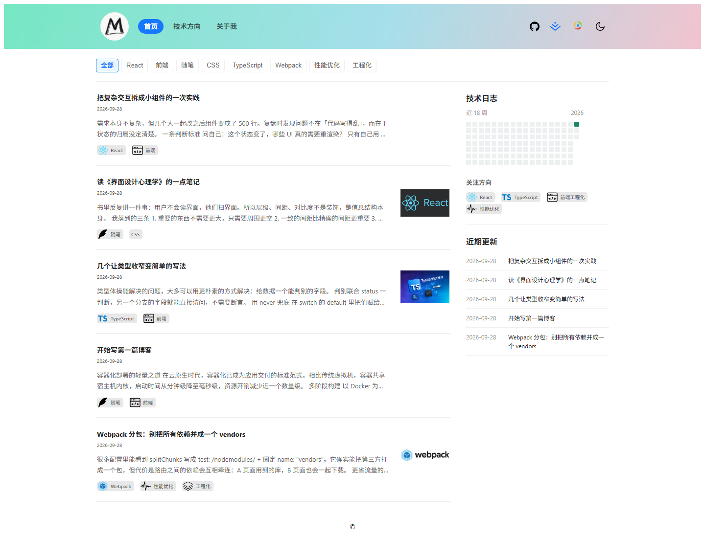
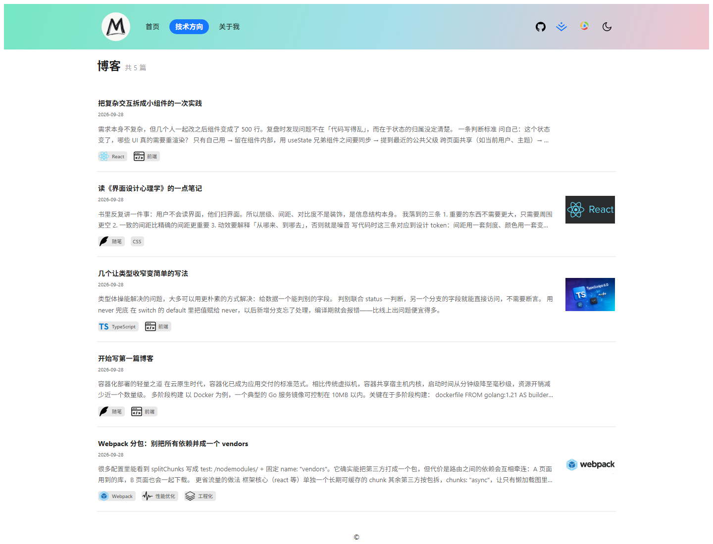
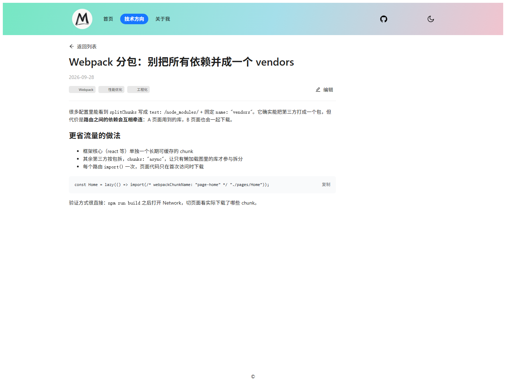
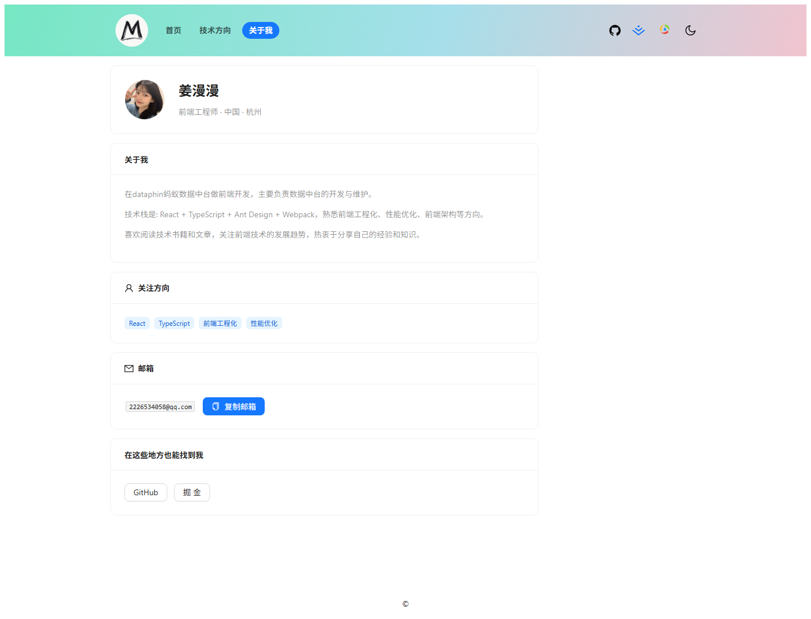

# 姜漫漫的技术博客

在线预览：<https://tech-blog.19521510370.workers.dev>

## 功能

**首页**

- 顶部导航：Logo + 「首页 / 技术方向 / 关于我」；右侧 GitHub、掘金、QQ、主题切换
- 标签筛选：按标签过滤文章，点「全部」重置
- 最近 5 篇文章：标题、日期、正文摘要、封面图、标签
- 技术日志：近 18 周的发布热力图，鼠标悬停看某天发了几篇
- 侧栏「关注方向」「近期更新」

**技术方向（博客）**

- 全部文章列表，每篇一张带摘要、封面、标签的卡片
- 文章详情：Markdown 正文（标题、加粗、斜体、行内代码、链接、列表、引用、代码块、分隔线），可返回列表

**关于我**

- 头像、姓名、头衔、城市
- 关于我、关注方向、社交链接
- 邮箱一键复制

**通用**

- 浅色 / 深色主题：首次跟随系统，手动切换后记住选择
- 导航栏邮箱图标：复制邮箱并唤起邮件客户端
- 移动端适配（760px / 480px 断点）
- 404 页

## 预览

> 「写文章 / 编辑 / 删除 / 草稿」的功能代码在，但入口由 `src/pages/Blog/PostList/index.tsx` 里的 `isAuth` 开关控制，目前是关闭的（还没接登录）。
